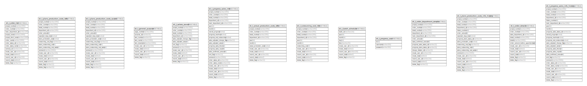

# demo

## Tables

| Name | Columns | Comment | Type |
| ---- | ------- | ------- | ---- |
| [sh_t_plans_production_costs_saved](sh_t_plans_production_costs_saved.md) | 17 | 予定工数一時保存 | BASIC TABLE |
| [sh_t_general_purpose](sh_t_general_purpose.md) | 10 | 汎用 | BASIC TABLE |
| [sh_t_salses_saved](sh_t_salses_saved.md) | 13 | 売上確定一時保存 | BASIC TABLE |
| [sh_t_progress_sales_info](sh_t_progress_sales_info.md) | 24 | 進捗度売上情報 | BASIC TABLE |
| [sh_t_actual_production_costs_info](sh_t_actual_production_costs_info.md) | 12 | 実績工数情報 | BASIC TABLE |
| [sh_t_outsourcing_cost_info](sh_t_outsourcing_cost_info.md) | 12 | 外注費情報 | BASIC TABLE |
| [sh_t_batch_schedule](sh_t_batch_schedule.md) | 10 | バッチスケジュール | BASIC TABLE |
| [sh_t_order_department_details](sh_t_order_department_details.md) | 15 | 受注明細部署情報 | BASIC TABLE |
| [sh_t_plans_production_costs_info_history](sh_t_plans_production_costs_info_history.md) | 19 | 予定工数情報履歴 | BASIC TABLE |
| [sh_t_order_details](sh_t_order_details.md) | 12 | 受注明細情報 | BASIC TABLE |
| [sh_t_progress_sales_info_history](sh_t_progress_sales_info_history.md) | 26 | 進捗度売上情報履歴 | BASIC TABLE |
| [sh_t_order_list](sh_t_order_list.md) | 14 | 受注情報 | BASIC TABLE |
| [sh_t_plans_production_costs_info](sh_t_plans_production_costs_info.md) | 17 | 予定工数情報 | BASIC TABLE |

## Relations

---

> Generated by [tbls](https://github.com/k1LoW/tbls)
