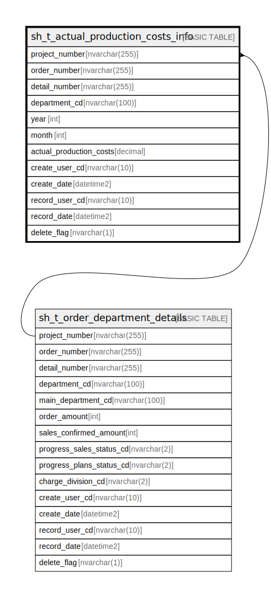

# sh_t_actual_production_costs_info

## Description

実績工数情報

## Columns

| Name | Type | Default | Nullable | Children | Parents | Comment |
| ---- | ---- | ------- | -------- | -------- | ------- | ------- |
| project_number | nvarchar(255) |  | false |  | [sh_t_order_department_details](sh_t_order_department_details.md) | PRNo. |
| order_number | nvarchar(255) |  | false |  | [sh_t_order_department_details](sh_t_order_department_details.md) | 受注No. |
| detail_number | nvarchar(255) |  | false |  | [sh_t_order_department_details](sh_t_order_department_details.md) | 明細No. |
| department_cd | nvarchar(100) |  | false |  | [sh_t_order_department_details](sh_t_order_department_details.md) | 部署ID |
| year | int |  | false |  |  | 年 |
| month | int |  | false |  |  | 月 |
| actual_production_costs | decimal | (NULL) | true |  |  | 実績工数 |
| create_user_cd | nvarchar(10) | (NULL) | true |  |  | 作成者コード |
| create_date | datetime2 | (NULL) | true |  |  | 作成日時 |
| record_user_cd | nvarchar(10) | (NULL) | true |  |  | 更新者コード |
| record_date | datetime2 | (NULL) | true |  |  | 更新日時 |
| delete_flag | nvarchar(1) | ((0)) | true |  |  | 削除フラグ:0未削除、1削除済 |

## Constraints

| Name | Type | Definition |
| ---- | ---- | ---------- |
| PK__sh_t_act_* | PRIMARY KEY | CLUSTERED, unique, part of a PRIMARY KEY constraint, [ project_number, order_number, detail_number, department_cd, year, month ] |
| FK__sh_t_actual_prod_* | FOREIGN KEY | FOREIGN KEY(project_number, order_number, detail_number, department_cd) REFERENCES sh_t_order_department_details(project_number, order_number, detail_number, department_cd) ON UPDATE NO_ACTION ON DELETE NO_ACTION |

## Indexes

| Name | Definition |
| ---- | ---------- |
| PK__sh_t_act_* | CLUSTERED, unique, part of a PRIMARY KEY constraint, [ project_number, order_number, detail_number, department_cd, year, month ] |

## Relations

---

> Generated by [tbls](https://github.com/k1LoW/tbls)
