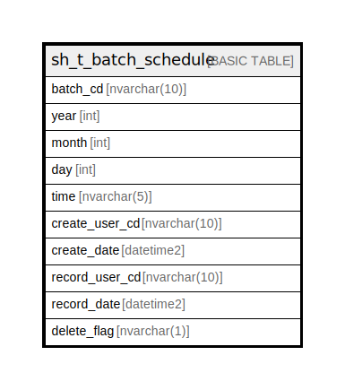

# sh_t_batch_schedule

## Description

バッチスケジュール

## Columns

| Name | Type | Default | Nullable | Children | Parents | Comment |
| ---- | ---- | ------- | -------- | -------- | ------- | ------- |
| batch_cd | nvarchar(10) |  | false |  |  | バッチCD |
| year | int |  | false |  |  | 実行年 |
| month | int |  | false |  |  | 実行月 |
| day | int |  | false |  |  | 実行日 |
| time | datetime2 |  | false |  |  | 実行時間 |
| create_user_cd | nvarchar(10) | (NULL) | true |  |  | 作成者コード |
| create_date | datetime2 | (NULL) | true |  |  | 作成日時 |
| record_user_cd | nvarchar(10) | (NULL) | true |  |  | 更新者コード |
| record_date | datetime2 | (NULL) | true |  |  | 更新日時 |
| delete_flag | nvarchar(1) | ((0)) | true |  |  | 削除フラグ:0未削除、1削除済 |

## Constraints

| Name | Type | Definition |
| ---- | ---- | ---------- |
| PK__sh_t_bat_* | PRIMARY KEY | CLUSTERED, unique, part of a PRIMARY KEY constraint, [ batch_cd, year, month, day, time ] |

## Indexes

| Name | Definition |
| ---- | ---------- |
| PK__sh_t_bat_* | CLUSTERED, unique, part of a PRIMARY KEY constraint, [ batch_cd, year, month, day, time ] |

## Relations

---

> Generated by [tbls](https://github.com/k1LoW/tbls)
