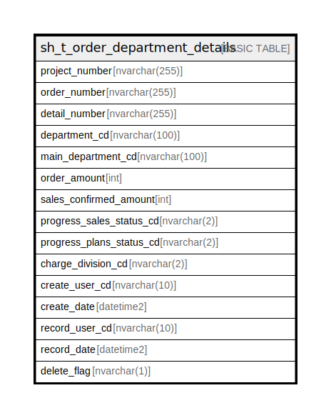

# sh_t_order_department_details

## Description

受注明細部署情報

## Columns

| Name | Type | Default | Nullable | Children | Parents | Comment |
| ---- | ---- | ------- | -------- | -------- | ------- | ------- |
| project_number | nvarchar(255) |  | false |  |  | PRNo. |
| order_number | nvarchar(255) |  | false |  |  | 受注No. |
| detail_number | nvarchar(255) | (NULL) | false |  |  | 明細No. |
| department_cd | nvarchar(100) | (NULL) | false |  |  | 部署ID |
| main_department_cd | nvarchar(100) | (NULL) | true |  |  | 主担当部署ID |
| order_amount | int | (NULL) | true |  |  | 分割受注金額或いは受注金額 |
| sales_confirmed_amount | int | ((0)) | true |  |  | 売上確定済金額 |
| progress_sales_status_cd | nvarchar(2) | (NULL) | true |  |  | 進捗ステータスコード（売上）:0ブラック、1売上未入力、2売上未入力（実績無し）、3売上入力中、4売上確定済、5売上最終確定済、6売上連携済、7全売上終了 |
| progress_plans_status_cd | nvarchar(2) | (NULL) | true |  |  | 進捗ステータスコード（予定工数）:1予定工数未入力、2予定工数入力中、3予定工数確定済、4予定工数最終確定済 |
| charge_division_cd | nvarchar(2) | ((0)) | true |  |  | 担当課コード:0なし、1課、2課、3課、4課、5課、6課、7課、8課、9課、10課 |
| create_user_cd | nvarchar(10) | (NULL) | true |  |  | 作成者コード |
| create_date | datetime2 | (NULL) | true |  |  | 作成日時 |
| record_user_cd | nvarchar(10) | (NULL) | true |  |  | 更新者コード |
| record_date | datetime2 | (NULL) | true |  |  | 更新日時 |
| delete_flag | nvarchar(1) | ((0)) | true |  |  | 削除フラグ:0未削除、1削除済 |

## Constraints

| Name | Type | Definition |
| ---- | ---- | ---------- |
| PK__sh_t_ord_* | PRIMARY KEY | CLUSTERED, unique, part of a PRIMARY KEY constraint, [ project_number, order_number, detail_number, department_cd ] |

## Indexes

| Name | Definition |
| ---- | ---------- |
| PK__sh_t_ord_* | CLUSTERED, unique, part of a PRIMARY KEY constraint, [ project_number, order_number, detail_number, department_cd ] |

## Relations

---

> Generated by [tbls](https://github.com/k1LoW/tbls)
