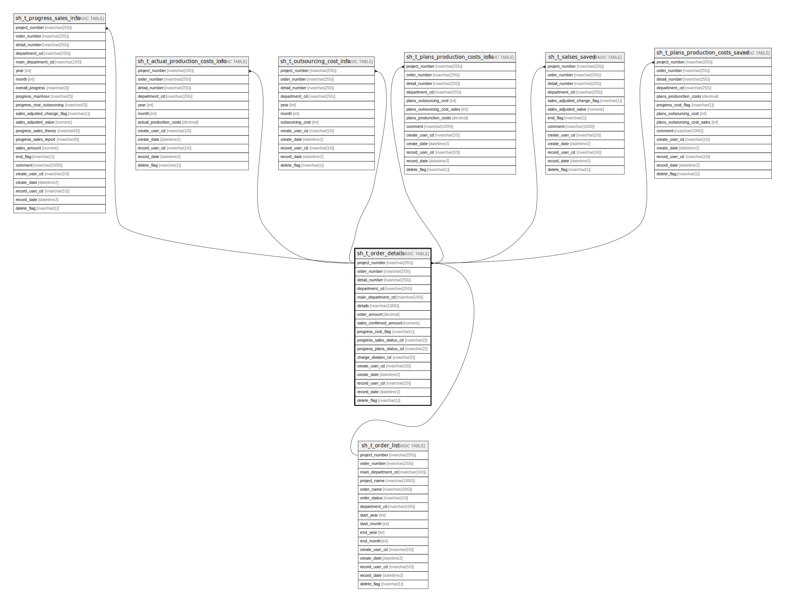

# sh_t_order_details

## Description

受注明細情報

## Columns

| Name | Type | Default | Nullable | Children | Parents | Comment |
| ---- | ---- | ------- | -------- | -------- | ------- | ------- |
| project_number | nvarchar(255) |  | false | [sh_t_order_department_details](sh_t_order_department_details.md) | [sh_t_order_list](sh_t_order_list.md) | PRNo. |
| order_number | nvarchar(255) |  | false | [sh_t_order_department_details](sh_t_order_department_details.md) | [sh_t_order_list](sh_t_order_list.md) | 受注No. |
| detail_number | nvarchar(255) | (NULL) | false | [sh_t_order_department_details](sh_t_order_department_details.md) |  | 明細No. |
| details | nvarchar(1000) | (NULL) | true |  |  | 明細内容 |
| order_amount_before_apportionment | int | (NULL) | true |  |  | 受注金額(按分前) |
| expected_days_before_divided | int | (NULL) | true |  |  | 予定工数(按分前) |
| create_user_cd | nvarchar(10) | (NULL) | true |  |  | 作成者コード |
| create_date | datetime2 | (NULL) | true |  |  | 作成日時 |
| record_user_cd | nvarchar(10) | (NULL) | true |  |  | 更新者コード |
| record_date | datetime2 | (NULL) | true |  |  | 更新日時 |
| delete_flag | nvarchar(1) | ((0)) | true |  |  | 削除フラグ:0未削除、1削除済 |
| divide_flag | nvarchar(1) | ((0)) | true |  |  | 按分フラグ:0按分なし、1按分あり |

## Constraints

| Name | Type | Definition |
| ---- | ---- | ---------- |
| PK__sh_t_ord_* | PRIMARY KEY | CLUSTERED, unique, part of a PRIMARY KEY constraint, [ project_number, order_number, detail_number ] |
| FK__sh_t_order_detai_* | FOREIGN KEY | FOREIGN KEY(project_number, order_number) REFERENCES sh_t_order_list(project_number, order_number) ON UPDATE NO_ACTION ON DELETE NO_ACTION |

## Indexes

| Name | Definition |
| ---- | ---------- |
| PK__sh_t_ord_* | CLUSTERED, unique, part of a PRIMARY KEY constraint, [ project_number, order_number, detail_number ] |

## Relations

---

> Generated by [tbls](https://github.com/k1LoW/tbls)
