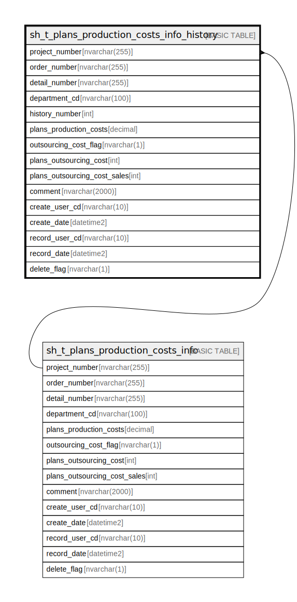

# sh_t_plans_production_costs_info_history

## Description

予定工数情報履歴

## Columns

| Name | Type | Default | Nullable | Children | Parents | Comment |
| ---- | ---- | ------- | -------- | -------- | ------- | ------- |
| project_number | nvarchar(255) |  | false |  |  | PRNo. |
| order_number | nvarchar(255) |  | false |  |  | 受注No. |
| detail_number | nvarchar(255) |  | false |  |  | 明細No. |
| department_cd | nvarchar(100) |  | false |  |  | 部署ID |
| history_number | int |  | false |  |  | 履歴番号 |
| order_amount | int | (NULL) | true |  |  | 分割受注金額或いは受注金額 |
| expected_days_total | decimal | (NULL) | true |  |  | 予定工数(按分前) |
| progress_plans_status_cd | nvarchar(2) | (NULL) | true |  |  | 進捗ステータスコード（予定工数）:1予定工数未入力、2予定工数入力中、3予定工数確定済、4予定工数最終確定済 |
| plans_production_costs | decimal | (NULL) | true |  |  | 予定工数 |
| outsourcing_cost_flag | nvarchar(1) | ('2') | true |  |  | 外注費有無:0なし、1あり、2未選択 |
| plans_outsourcing_cost | int | (NULL) | true |  |  | 予定外注費 |
| plans_outsourcing_cost_sales | int | (NULL) | true |  |  | 予定外注費売上 |
| comment | nvarchar(2000) | (NULL) | true |  |  | コメント |
| create_user_cd | nvarchar(10) | (NULL) | true |  |  | 作成者コード |
| create_date | datetime2 | (NULL) | true |  |  | 作成日時 |
| record_user_cd | nvarchar(10) | (NULL) | true |  |  | 更新者コード |
| record_date | datetime2 | (NULL) | true |  |  | 更新日時 |
| divide_flag | nvarchar(1) | (NULL) | true |  |  | 按分フラグ:0按分なし、1按分あり |
| delete_flag | nvarchar(1) | ((0)) | true |  |  | 削除フラグ:0未削除、1削除済 |

## Constraints

| Name | Type | Definition |
| ---- | ---- | ---------- |
| PK__sh_t_pla_* | PRIMARY KEY | CLUSTERED, unique, part of a PRIMARY KEY constraint, [ project_number, order_number, detail_number, department_cd, history_number ] |

## Indexes

| Name | Definition |
| ---- | ---------- |
| PK__sh_t_pla_* | CLUSTERED, unique, part of a PRIMARY KEY constraint, [ project_number, order_number, detail_number, department_cd, history_number ] |

## Relations

---

> Generated by [tbls](https://github.com/k1LoW/tbls)
