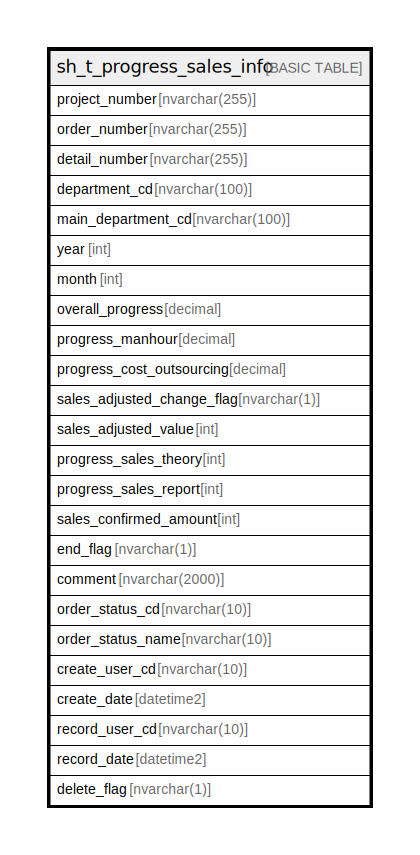

# sh_t_progress_sales_info

## Description

進捗度売上情報

## Columns

| Name | Type | Default | Nullable | Children | Parents | Comment |
| ---- | ---- | ------- | -------- | -------- | ------- | ------- |
| project_number | nvarchar(255) |  | false |  |  | PRNo. |
| order_number | nvarchar(255) |  | false |  |  | 受注No. |
| detail_number | nvarchar(255) |  | false |  |  | 明細No. |
| department_cd | nvarchar(100) |  | false |  |  | 部署コード |
| main_department_cd | nvarchar(100) | (NULL) | true |  |  | 主担当部署コード |
| year | int | (NULL) | true |  |  | 年 |
| month | int | (NULL) | true |  |  | 月 |
| overall_progress | nvarchar(3) | (NULL) | true |  |  | 全体進捗度 |
| progress_manhour | nvarchar(3) | (NULL) | true |  |  | 工数進捗度 |
| progress_cost_outsourcing | nvarchar(3) | (NULL) | true |  |  | 外注費進捗度 |
| sales_adjusted_change_flag | nvarchar(1) | ((0)) | true |  |  | 売上調有無 |
| sales_adjusted_value | numeric | (NULL) | true |  |  | 売上調整値 |
| progress_sales_theory | nvarchar(3) | (NULL) | true |  |  | 進捗度売上（理論値） |
| progress_sales_report | nvarchar(3) | (NULL) | true |  |  | 進捗度売上（報告値) |
| sales_amount | numeric | (NULL) | true |  |  | 売上金額 |
| end_flag | nvarchar(1) | ((0)) | true |  |  | 終了フラグ |
| comment | nvarchar(1000) | (NULL) | true |  |  | コメント |
| create_user_cd | nvarchar(10) | (NULL) | true |  |  | 作成者コード |
| create_date | datetime2 | (NULL) | true |  |  | 作成日時 |
| record_user_cd | nvarchar(10) | (NULL) | true |  |  | 更新者コード |
| record_date | datetime2 | (NULL) | true |  |  | 更新日時 |
| delete_flag | nvarchar(1) | ((0)) | true |  |  | 削除フラグ |

## Constraints

| Name | Type | Definition |
| ---- | ---- | ---------- |
| PK__sh_t_pro_* | PRIMARY KEY | CLUSTERED, unique, part of a PRIMARY KEY constraint, [ project_number, order_number, detail_number, department_cd ] |

## Indexes

| Name | Definition |
| ---- | ---------- |
| PK__sh_t_pro_* | CLUSTERED, unique, part of a PRIMARY KEY constraint, [ project_number, order_number, detail_number, department_cd ] |

## Relations

---

> Generated by [tbls](https://github.com/k1LoW/tbls)
